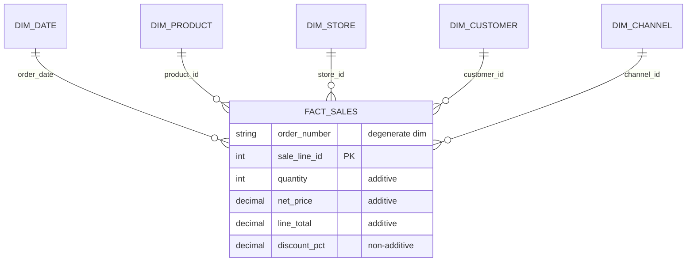

# Board Brief -- S02 : Première étoile (EXEMPLE ANNOTÉ)

> **Ce fichier est un exemple.** Votre vrai brief est dans `answers/S02_executive_brief.md`.
> Les annotations entre `[-> ... ]` expliquent pourquoi chaque section fonctionne.

> **Temps estimé :** ~90 minutes total
> — 30 min de discussion en classe (grain + étoile) + 40 min de SQL + 20 min de rédaction du brief.
> Si vous dépassez 2 h sur un brief, c'est un signal : demandez à votre assistant IA ou à un pair
> plutôt que de pousser seul.

> **Question du CEO :** Quelles catégories de produits déclinent dans quelles régions, par trimestre ?

## Grain statement

**1 ligne = 1 ligne de commande** identifiée par `(order_number, sale_line_id)`.

[-> Le grain est explicite, non ambigu, et vérifiable. Le lecteur sait immédiatement
ce que chaque ligne représente sans devoir lire le DDL.]

## Étoile construite



- **5 dimensions conformes** reliées par FK à `fact_sales`
- Mesures : `quantity` (additive), `net_price` (additive), `line_total` (additive), `discount_pct` (non-additive -> moyenne pondérée)

[-> Le diagramme Mermaid se rend automatiquement dans VS Code (avec l'extension
`Markdown Preview Mermaid Support`, déjà installée par le devcontainer) et
directement sur GitHub. Pas de PNG à maintenir.]

[-> Le diagramme est simple et montre la structure sans détail inutile.
La distinction additive / non-additive montre une compréhension du concept.]

### Comment générer ce diagramme avec votre assistant IA

Collez un prompt comme celui-ci dans Copilot Chat :

> *« Génère un diagramme Mermaid `erDiagram` pour mon étoile NexaMart.
> Au centre : `FACT_SALES` au grain « une ligne de commande »
> (`order_number` + `sale_line_id`), avec les mesures `quantity`, `net_price`,
> `line_total`, `discount_pct`. Cinq dimensions reliées par FK :
> `dim_date`, `dim_product`, `dim_store`, `dim_customer`, `dim_channel`.
> Inclus le bloc dans un fichier Markdown. »*

Un modèle complet, prêt à copier, est disponible dans
[`docs/visuals/star-schema.md`](visuals/star-schema.md).


## SQL preuve

```sql
SELECT
    p.category,
    s.region,
    d.quarter,
    SUM(f.line_total)   AS total_revenue,
    COUNT(*)             AS nb_lignes
FROM fact_sales f
JOIN dim_product  p ON f.product_id  = p.product_id
JOIN dim_store    s ON f.store_id    = s.store_id
JOIN dim_date     d ON f.order_date  = d.date_key
GROUP BY p.category, s.region, d.quarter
ORDER BY total_revenue DESC
LIMIT 10;
```

| category    | region  | quarter | total_revenue | nb_lignes |
|-------------|---------|---------|---------------|-----------|
| Electronics | Québec  | Q4      | 142 350.00    | 1 203     |
| Clothing    | Ontario | Q4      | 98 720.50     | 876       |
| ...         | ...     | ...     | ...           | ...       |

[-> La requête répond directement à la question du CEO. Les résultats sont présentés
en format tableau business, pas en dump SQL brut. Les chiffres sont cohérents avec
le grain (nb_lignes plausible pour le volume de données généré).]

## Réponse au CEO

Les catégories **Electronics** et **Clothing** dominent en Q4, concentrées au **Québec**
et en **Ontario**. Les régions **Alberta** et **BC** montrent des baisses en Q3,
possiblement liées à la saisonnalité.

**Recommandation :** Investiguer les retours (S06) pour vérifier si le déclin en Q3
reflète une vraie baisse de demande ou un taux de retour élevé.

[-> La réponse est en langage business, pas technique. Elle propose une action concrète
et anticipe la prochaine étape du cours (S06 -- retours + drill-across).]
